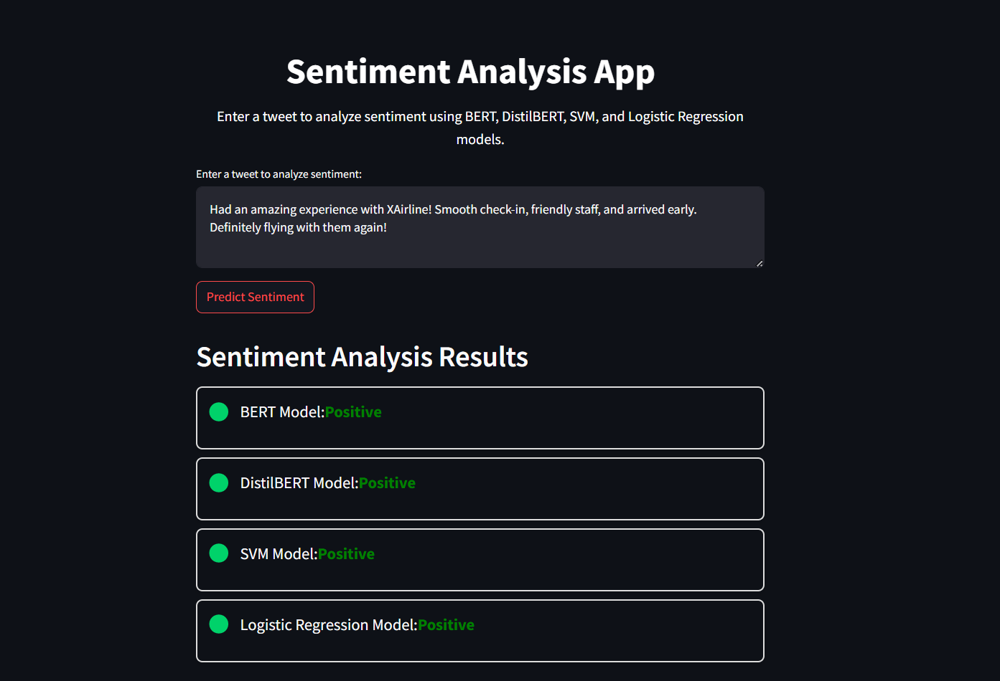

# Airline Tweet Sentiment Analysis

## Overview
This project performs sentiment analysis on tweets about airlines, classifying them as positive, negative, or neutral based on user opinions shared on Twitter. It leverages machine learning techniques and natural language processing (NLP) models, including transformer-based models, to predict sentiment and analyze customer feedback.

## Project Details
This project utilizes a dataset of airline-related tweets to determine sentiment. We employed multiple machine learning models, including BERT, DistilBERT, Logistic Regression, and Support Vector Machines (SVM), to evaluate and compare sentiment predictions. The goal is to analyze customer opinions and help improve airline services by understanding user sentiment.

## Requirements
To run this project, ensure that you have the following installed:
- Python 3.x
- Pip (Python package manager)
- Virtual Environment (optional but recommended)

Install the required dependencies by running:
```bash
pip install -r requirements.txt
```

## Setup
1. Clone the repository:
   ```bash
   git clone https://github.com/uameless/airline-tweet-sentiment.git
   ```
2. (Optional) Set up a virtual environment:
   ```bash
   python -m venv venv
   source venv/bin/activate  # On Windows: venv\Scripts\activate
   ```
3. Install the necessary libraries:
   ```bash
   pip install -r requirements.txt
   ```

## File Structure
```
├── data/          # Dataset of tweets for analysis
├── models/        # Saved model files
├── notebook/      # Jupyter notebook for preprocessing and sentiment analysis
├── app/           # Streamlit UI for user interaction
├── requirements.txt  # Python dependencies
├── README.md      # Project documentation
```

## Application Screenshots
### Sentiment Analysis Test App



## Contributors
- **EL HACHYMI Ahmed Yassine**
- **AJI Othmane**
- **BOURI Souhail**
- **RHOUATI Mohammed**

